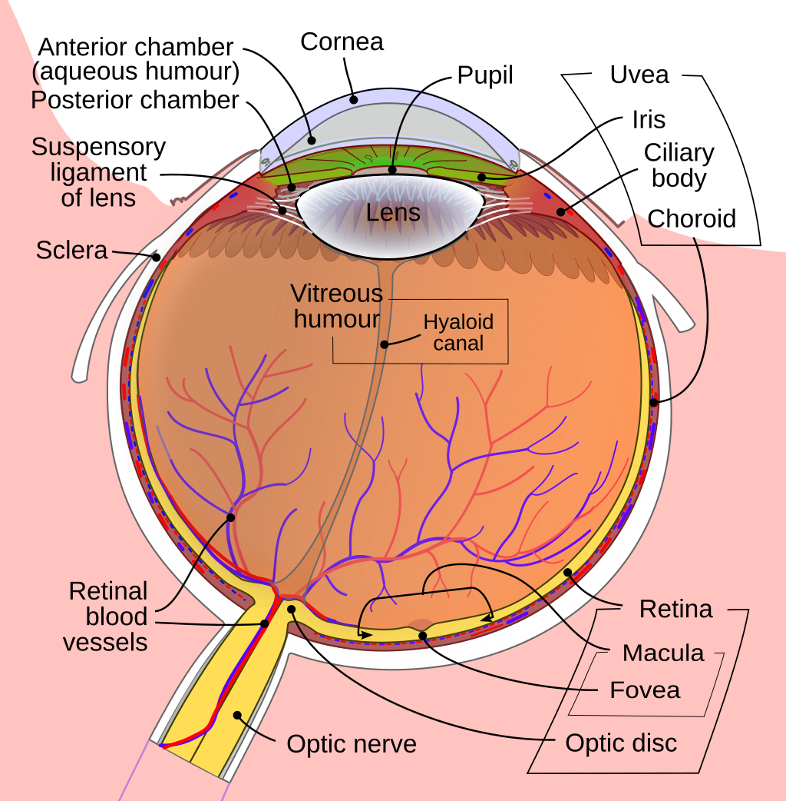
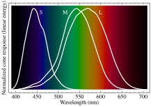

# 03-颜色和3D图形绘制

1. **可见光谱**
   - 可见光谱的范围和特点
   - 光谱与颜色的关系

2. **人眼对色彩的感知**
   - 人眼的色彩感知机制
   - 色彩感知的生理学基础
   - 亮度感知与Gamma
        - Gamma校正的概念
        - Gamma曲线与线性空间
        - 线性空间在渲染中的应用

3. **CIE颜色空间**
   - 颜色空间的定义
   - CIE XYZ颜色空间
   - CIE LAB和CIE LCH颜色空间
   - 色温的标定
     - 色温的定义与开尔文温标
     - 白点的定义（D65、D60等）
   - 基于D65和D60衍生出的色域
     - sRGB色域
     - Adobe RGB色域
     - ProPhoto RGB色域
     - DCI-P3色域

4. **高动态范围（HDR）与低动态范围（LDR）**
   - HDR与LDR的区别
   - LDR（sRGB）简介
   - HDR技术的应用和发展
     - HDR显示器的特点
     - HDR的实现技术

5. **色调映射（Tone Mapping）**
   - 全局色调映射（Global Tone Mapping）
     - 全局色调映射的基本原理
     - 常用的全局色调映射算法
   - 局部色调映射（Local Tone Mapping）
     - 局部色调映射的基本原理
     - 常用的局部色调映射算法
     - 全局色调映射与局部色调映射的比较

6. **ACES（色彩管理系统）**
   - ACES的定义与目的
   - ACES的颜色空间与色域
     - ACEScct
     - ACES2065-1
   - ACES如何整合和管理不同色域
     - 色彩转换和统一色彩空间
   - ACES与色调映射的整合

## 1. 可见光谱

### 光线与光谱的基本概念
在探讨可见光谱之前，我们首先需要了解光线和光谱的基本概念。光线是我们视觉感知中的关键元素，它实际上是电磁波的一种表现形式。光线不仅包括我们能见到的可见光，还包括我们看不到的其他类型的电磁波，如红外线和紫外线。

光谱是光线中不同波长或频率的组成部分。它将光线的不同部分按照波长或频率进行分解，形成一个图像或图谱，展现出光的不同成分。光谱可以是连续的，也可以是离散的，取决于光源和光谱分析的方式。

光线的性质
光线具有以下几个基本性质：

- **波动性**：光线表现出波动特性，可以用波长、频率等来描述。光的波动性意味着光线具有周期性变化的性质，这种变化决定了我们感知的颜色。
- **粒子性**：光线也表现出粒子性，这意味着它可以看作由称为光子的微小粒子组成。光子的能量与光的波长有关，波长越短，光子能量越高。

### 可见光谱的范围和特点

可见光谱指的是人眼能够感知的电磁波范围。这一范围的波长从大约380纳米（紫色）到780纳米（红色）。在这个范围内，光的波长决定了我们所感知的颜色。虽然实际的可见光谱是连续的，但为了简化，常常将其划分为不同的颜色段，如红色、橙色、黄色、绿色、蓝色、靛蓝色和紫色。

- **波长范围**：可见光的波长从380纳米（nm）到780纳米。波长较短的光（如紫色）具有较高的能量，而波长较长的光（如红色）则具有较低的能量。
- **光谱分布**：自然光谱呈现出一个连续的颜色渐变，从紫色到红色。在这个范围内，不同的波长会产生不同的颜色感知。
- **光谱特点**：可见光谱是一个相对窄的范围，相比之下，整个电磁波谱（包括射线、微波、红外线、紫外线等）要宽得多。可见光谱的颜色强度分布在不同的波长上会有所不同，常见的光源如太阳光、荧光灯和LED灯都具有各自特定的光谱分布。

### 光谱与颜色的关系

光的颜色是由光的波长决定的。当光波穿过一个分光棱镜时，不同波长的光被折射成不同的颜色，这就是光谱的形成。以下是光谱与颜色关系的关键点：

- **波长与颜色**：波长越短，光的颜色越接近紫色；波长越长，光的颜色越接近红色。例如，约450纳米的光波通常被感知为蓝色，而650纳米的光波被感知为红色。
- **颜色混合**：不同波长的光混合会形成新的颜色。这种现象在自然界和各种显示技术中都很常见。例如，红色和绿色的光混合会产生黄色，这基于加色混合原理。
- **色谱分析**：通过光谱分析仪可以准确测量光的波长和强度，这在科学研究、显示技术和色彩管理中都非常重要。例如，了解一个光源的光谱分布可以帮助我们调节其色温，使其更适合不同的应用场景。

可见光谱不仅是色彩科学的基础，也是许多技术应用的核心。了解光谱如何与颜色关联，能够帮助我们更好地进行颜色管理和色彩渲染。

## 2. 人眼对色彩的感知

### 人眼的结构
人眼的结构非常复杂，它负责接收光信号并将其转换为我们所感知的图像。以下是人眼的几个关键结构及其功能：

- **瞳孔（Pupil）**：瞳孔是虹膜（Iris）中心的开口，类似于相机的光圈。它能够根据光线的强弱自动收缩或扩张，以控制进入眼睛的光线量。
- **晶状体（Lens）**：光线通过瞳孔后，会经过晶状体。晶状体相当于人眼的镜头，通过调节其厚度来控制光线的聚焦，确保光线准确地投射到视网膜上。
- **玻璃体（Vitreous）**：光线经过晶状体后，穿过充满半透明凝胶的玻璃体，这种物质填充了眼球的大部分区域，并保持眼球的形状。
- **视网膜（Retina）**：视网膜是光线投射的最终目标，它类似于相机的胶卷，负责接收光线并将其转换成电脉冲，通过视神经传递到大脑进行处理。
- **感光细胞（Photoreceptors）**：视网膜上包含感光细胞，主要有两种类型：视杆细胞（Rods）和视锥细胞（Cones）。这些细胞负责不同的视觉任务，视杆细胞在低光环境下有效，而视锥细胞则负责颜色感知和在较强光照下的视觉。

### 人眼的色彩感知机制

人眼对色彩的感知主要依赖于视网膜上的光感受器，特别是视锥细胞。视网膜中有三种主要的视锥细胞，每种视锥细胞对不同波长的光最为敏感，从而使我们能够感知不同的颜色。这三种视锥细胞对应于以下颜色敏感区域：

- **S型视锥细胞**：对短波长（蓝紫色区域）最为敏感。
- **M型视锥细胞**：对中波长（绿色区域）最为敏感。
- **L型视锥细胞**：对长波长（红色区域）最为敏感。

这些视锥细胞的信号通过视神经传输到大脑，大脑根据这些信号进行颜色的综合和解码，从而形成我们所感知的色彩。

### 色彩感知的生理学基础

色彩感知的生理学基础涉及几个关键因素：

- **色彩敏感性**：视锥细胞对不同波长的光具有不同的敏感度，这种敏感度决定了我们对色彩的感知。例如，人眼对绿色的敏感度通常比对蓝色或红色更高。
- **色彩适应**：人眼能够在不同的光照条件下调整其色彩感知能力。比如，当在强光下时，人眼会自动降低对光的敏感度，以保持颜色感知的一致性。
- **颜色对比**：颜色的感知不仅取决于光的波长，还受到周围颜色的影响。边缘对比和背景颜色可以显著影响我们对某种颜色的感知。

### 亮度感知与Gamma

亮度感知是视觉系统中一个至关重要的方面，涉及到我们如何处理和解释光的强度。接下来，我们将详细探讨亮度的定义、计算方法。

#### 亮度的定义和计算

亮度（Luminance）是感知亮度的量度，代表一个视觉信号中反射或发射的光的强度。它与我们眼睛对光线的感知密切相关。在色彩科学中，亮度的计算涉及不同颜色通道的加权平均。通常，亮度的计算考虑到人眼对不同颜色的感知敏感度。人眼对绿色的感知最为敏感，次之是红色和蓝色。因此，亮度的计算公式通常如下：

- **计算公式**：亮度通常可以通过以下加权公式来计算：
  $$
  L = 0.299 \times R^* + 0.587 \times G^* + 0.114 \times B^*
  $$
  这里，R*、G*和B*分别是红色、绿色和蓝色通道的亮度值。权重系数反映了人眼对不同颜色的敏感度，其中绿色的权重最高，因为人眼对绿色最为敏感。
这个公式源于国际电信联盟（ITU）为电视广播标准（如Rec. 601）定义的亮度加权系数。

#### CMOS传感器的亮度计算

在CMOS图像传感器中，亮度的计算方法可能有所不同，因为CMOS传感器通常采用不同的颜色滤光片阵列（CFA）。一种常见的阵列是Bayer滤镜阵列，其中包括两个绿色像素、一个红色像素和一个蓝色像素。对于这种阵列，亮度的计算通常使用以下公式：

- **CMOS亮度计算公式**：
  $$
  L = 0.25 \times R^* + 0.5 \times G^* + 0.25 \times B^*
  $$
  这个公式考虑了绿色像素的数量是红色和蓝色像素的两倍，因此绿色对整体亮度的贡献较大。

#### 亮度感知与Gamma校正

Gamma校正是调整图像亮度以适应显示设备非线性响应的一种技术。人眼对亮度的感知是非线性的，即感知亮度的变化并不是与实际光线强度的变化成正比。这种感知的非线性可以用一个Gamma值来描述。

Gamma值（γ）通常用于表示图像数据的非线性度。如果一个显示设备（例如CRT显示器）需要一个Gamma值来校正其输出，这个Gamma值会影响显示图像的亮度。

- **Gamma校正的公式：**

$$ I_{\text{out}} = I_{\text{in}}^{\frac{1}{\gamma}} $$

其中，$ I_{\text{in}} $ 是输入信号，$ I_{\text{out}} $ 是经过Gamma校正后的输出信号，γ 是Gamma值。

- **4. 人眼特性与Gamma**

人眼对光线的感知是非线性的，即对于亮度的感知变化较小。例如，亮度感知的变化大约遵循对数规律。这意味着，在视觉系统中，亮度的感知更适合用对数尺度来描述。在数码图像处理中，Gamma校正通常会设置在2.2左右，这是因为大多数显示设备（如CRT显示器）的响应特性接近这个Gamma值。

#### 中性灰
中性灰在视觉系统中起到一个基准作用，它的亮度值不受色彩的影响。Gamma校正中的一个重要目标就是确保中性灰在显示图像时能够保持其自然的灰度。
在RGB色彩模式下，指的是R：G：B=1：1：1 ，即红绿蓝三色数值相等，即为中性灰， 看，下图中间的一小点叠加部分就是中性灰： 当R=G=B=128，被称作“绝对中性灰”。

#### Gamma曲线与线性空间

- **Gamma曲线**：Gamma曲线是一个函数，描述了输入信号（如图像的像素值）与输出亮度之间的关系。常见的Gamma值为2.2，这个值适用于大多数显示器。
- **线性空间**：在计算机图形学中，线性空间指的是没有经过Gamma校正的原始图像数据。线性空间中的亮度值与实际光强度成正比，因此在渲染和合成图像时通常使用线性空间，以确保图像处理的准确性。

#### 线性空间在渲染中的应用

在渲染过程中，使用线性空间可以获得更准确的颜色和亮度计算。由于图像的光强度在实际世界中是线性的，因此将图像数据保持在线性空间内有助于：

- **颜色合成**：确保颜色合成时的光线和颜色计算正确，例如在光照模型中。
- **高动态范围成像**：处理高动态范围图像时，线性空间使得亮度计算更加精确，避免了非线性变换带来的失真。
- **后期处理**：线性空间可以确保后期处理效果的一致性，比如在进行色调映射时。

在实际应用中，图像通常会在渲染和处理过程中使用线性空间，但最终显示在屏幕上时需要进行Gamma校正，以便与人眼的感知一致。

### 3. CIE颜色空间

对的，你说得对。颜色空间是一个重要的概念，理解它能帮助我们更好地掌握颜色相关的技术和标准。下面是对颜色空间的解释：

---

### 颜色空间

**3.1 颜色空间的定义**

颜色空间（Color Space）是一个数学模型，用于表示颜色。它定义了一组颜色的范围以及如何在这个范围内描述和管理颜色。颜色空间通常包括一组坐标和一个范围，允许我们在这个空间内精确地定义颜色。

**颜色空间的组成**

- **坐标系统**：颜色空间通常定义了一个坐标系统，用来描述颜色的位置。例如，RGB颜色空间使用红色（R）、绿色（G）和蓝色（B）三种颜色通道的值来表示颜色。
  
- **范围**：颜色空间规定了可以表示的颜色范围，这个范围称为色域（Color Gamut）。不同的颜色空间能够表示不同范围的颜色。

**颜色空间的类型**

- **RGB颜色空间**：基于红色、绿色和蓝色通道。常用于显示器、相机和扫描仪等设备。RGB颜色空间包括sRGB、Adobe RGB等。

- **CMYK颜色空间**：基于青色（Cyan）、品红色（Magenta）、黄色（Yellow）和黑色（Key）。主要用于印刷领域。

- **Lab颜色空间**：基于人眼的感知方式，包含亮度（L）和两个颜色分量（a和b）。常用于色彩调整和色彩科学研究。

- **HSV和HSL颜色空间**：基于色相（Hue）、饱和度（Saturation）和亮度（Value）或明度（Lightness）。常用于图像编辑和计算机图形学。

**3.2 CIE XYZ颜色空间**

CIE XYZ颜色空间是由国际照明委员会（CIE）于1931年提出的，它为颜色科学提供了一个标准化的基准系统。CIE XYZ颜色空间基于对人眼颜色感知的实验数据，通过对所有可见光谱的颜色匹配进行定义。它的设计目标是创建一个能够表示所有颜色的空间，同时具有良好的数学性质。

- **X、Y、Z**：CIE XYZ颜色空间包括三个正交的颜色分量：X、Y 和 Z。X 和 Z 分量代表了光谱的红色和蓝色部分，而 Y 分量则表示亮度。这些分量的组合能够唯一地表示所有可见颜色。

- **色度图**：在CIE XYZ空间中，X 和 Z 分量的比值定义了色度图（Chromaticity Diagram）。这个图表显示了所有可能的颜色（除了白色）在色度图中的位置。

**3.3 CIE LAB和CIE LCH颜色空间**

为了更好地符合人眼对颜色差异的感知，CIE还定义了两个与CIE XYZ相关的颜色空间：CIE LAB 和 CIE LCH。

- **CIE LAB颜色空间**：
  - **L**（亮度）：表示颜色的明亮度，从0（黑色）到100（白色）。
  - **a**（红-绿轴）：表示从绿色到红色的颜色分量。
  - **b**（黄-蓝轴）：表示从蓝色到黄色的颜色分量。
  
  CIE LAB颜色空间被设计成与人眼的感知更为一致，使得颜色之间的差异更符合视觉感知。

- **CIE LCH颜色空间**：
  - **L**（亮度）：与CIE LAB相同。
  - **C**（色度）：表示颜色的饱和度，计算方式为 $\sqrt{a^2 + b^2}$。
  - **H**（色相）：表示颜色的色调，计算方式为 $\arctan\left(\frac{b}{a}\right)$，结果以角度表示。
  
  CIE LCH是CIE LAB的极坐标表示，常用于色彩编辑和视觉效果调整，因为它更接近人眼对色彩变化的感知方式。

**3.3 色温的标定**

色温（Color Temperature）是描述光源颜色的标准，它与光源的物理温度相关。色温的标定对于颜色科学和图像处理非常重要。

- **色温的定义与开尔文温标**：
  - 色温定义为将一个理想的黑体辐射体加热到特定温度时，其辐射颜色与该光源颜色的匹配度。色温的单位是开尔文（K），例如，标准的日光色温约为6500K。
  - 低色温（如2700K）表现为暖色调，而高色温（如6500K）则表现为冷色调。色温与光源的实际光谱有关。

- **白点的定义（D65、D60等）**：
  - 白点是色温标定的基准，代表在该色温下的光源色彩。D65是常用的标准白点，代表色温为6500K，通常用于摄影和显示设备中。
  - D60代表色温为6000K，常用于一些专业的色彩管理应用。

**3.4 基于D65和D60衍生出的色域**

色域（Color Gamut）表示颜色空间的范围，用于描述显示设备或图像可以呈现的颜色范围。以下是一些基于D65和D60白点的主要色域：

- **sRGB色域**：
  - sRGB（标准红绿蓝色域）是由HP和Microsoft于1996年定义的，用于在互联网和计算机显示器上标准化颜色。它基于D65白点，色域覆盖了大多数普通显示设备和网络图像的颜色范围。
  - sRGB色域广泛应用于网页设计、数字摄影和大多数消费级显示设备。

- **Adobe RGB色域**：
  - Adobe RGB色域是Adobe公司于1998年推出的，旨在提供比sRGB更广泛的颜色范围。它特别适合于专业打印和图像编辑，因为它能够覆盖更多的绿色和青色区域。
  - Adobe RGB色域也基于D65白点，但其色域范围超出了sRGB，适合高质量的印刷工作。

- **ProPhoto RGB色域**：
  - ProPhoto RGB（也称为RGB 1998）是由Kodak开发的，旨在提供最大的颜色范围。它包含了比Adobe RGB更广泛的颜色空间，适用于高动态范围的图像处理和专业打印。
  - ProPhoto RGB色域也基于D65白点，但其颜色范围极为广泛，能够覆盖更多的色彩细节。

- **DCI-P3色域**：
  - DCI-P3是数字电影行业使用的色域标准，提供比sRGB更广泛的色彩范围，特别是在红色和绿色方面。
  - DCI-P3色域基于D65白点，广泛应用于高端显示设备和电影放映，以提供更丰富的色彩表现。
